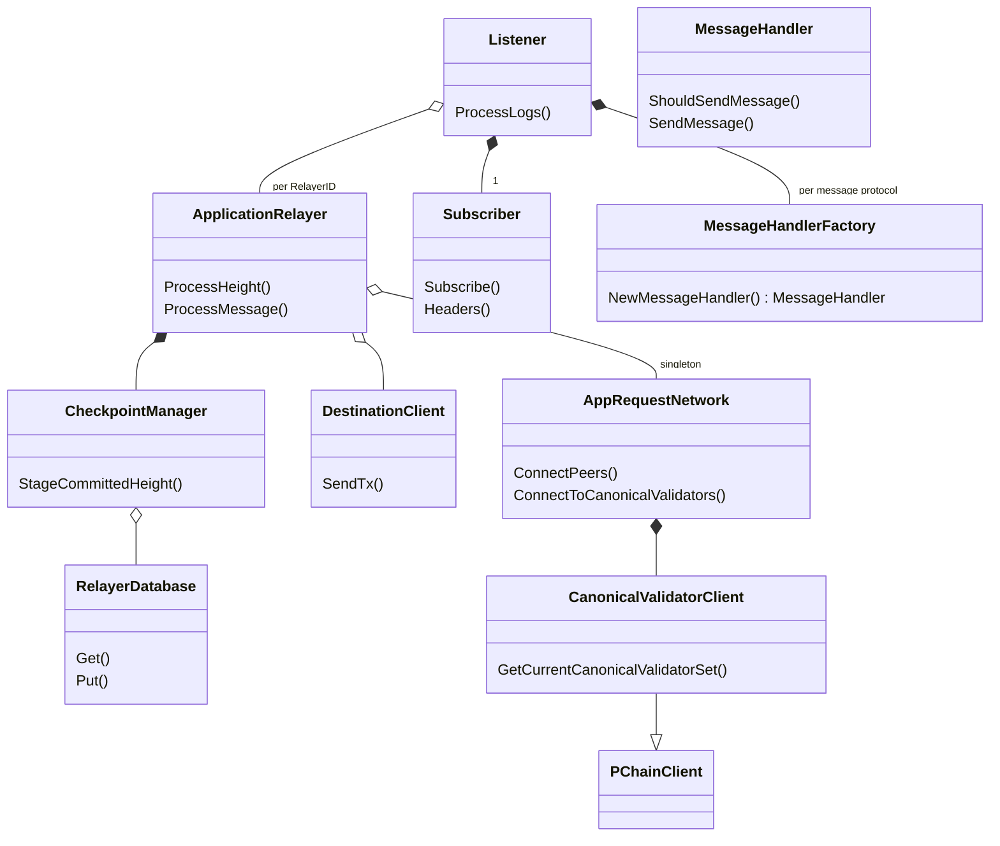

# Architecture
Partial class diagram illustrating the important classes and functions for processing incoming blocks and relaying the contained Warp messages.

```mermaid
classDiagram
    Listener o-- "per RelayerID" ApplicationRelayer
    Listener *-- "1" Subscriber
    Listener *-- "per message protocol" MessageHandlerFactory
    ApplicationRelayer o-- "singleton" AppRequestNetwork
    ApplicationRelayer o-- DestinationClient
    ApplicationRelayer *-- CheckpointManager
    CheckpointManager o-- RelayerDatabase
    AppRequestNetwork *-- CanonicalValidatorClient
    CanonicalValidatorClient --|> PChainClient

    Listener : ProcessLogs()
    ApplicationRelayer : ProcessHeight()
    ApplicationRelayer : ProcessMessage()
    CheckpointManager : StageCommittedHeight()
    Subscriber : Subscribe()
    Subscriber : Headers()
    DestinationClient : SendTx()
    MessageHandlerFactory : NewMessageHandler() MessageHandler
    MessageHandler : ShouldSendMessage()
    MessageHandler : SendMessage()
    RelayerDatabase : Get()
    RelayerDatabase : Put()
    AppRequestNetwork : ConnectPeers()
    AppRequestNetwork : ConnectToCanonicalValidators()
    CanonicalValidatorClient : GetCurrentCanonicalValidatorSet()
```