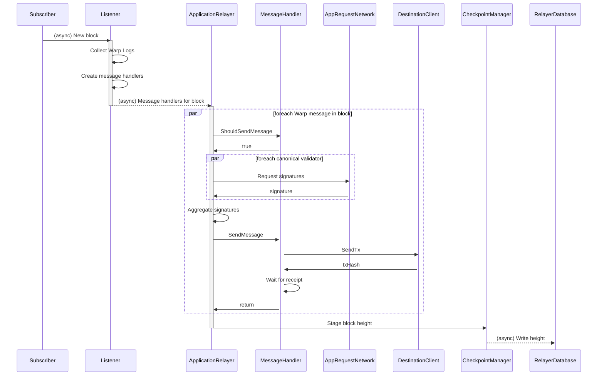

# Processing the Warp messages in a new block
Illustration of the sequence of events triggered by a new block containing Warp messages to relay.

```mermaid
sequenceDiagram
    participant Subscriber
    participant Listener
    participant ApplicationRelayer
    participant MessageHandler
    participant AppRequestNetwork
    participant DestinationClient
    participant CheckpointManager
    participant RelayerDatabase

    Subscriber->>Listener : (async) New block
    activate Listener
    Listener->>Listener : Collect Warp Logs
    Listener->>Listener : Create message handlers
    Listener-->>ApplicationRelayer : (async) Message handlers for block
    deactivate Listener
    activate ApplicationRelayer
    par foreach Warp message in block
        ApplicationRelayer->>MessageHandler : ShouldSendMessage
        activate MessageHandler
        MessageHandler->>ApplicationRelayer : true

        par foreach canonical validator
            ApplicationRelayer->>AppRequestNetwork : Request signatures
            activate AppRequestNetwork
            AppRequestNetwork->>ApplicationRelayer : signature
        end
        ApplicationRelayer->>ApplicationRelayer : Aggregate signatures

        ApplicationRelayer->>MessageHandler : SendMessage
        activate MessageHandler
        MessageHandler->>DestinationClient : SendTx
        activate DestinationClient
        DestinationClient->>MessageHandler : txHash
        MessageHandler->>MessageHandler : Wait for receipt
        MessageHandler->>ApplicationRelayer : return
    end
    ApplicationRelayer->>CheckpointManager : Stage block height
    deactivate ApplicationRelayer
    CheckpointManager-->>RelayerDatabase : (async) Write height
```